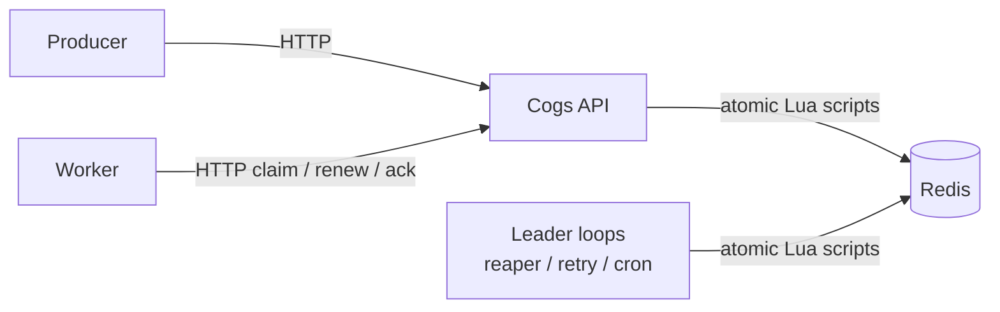
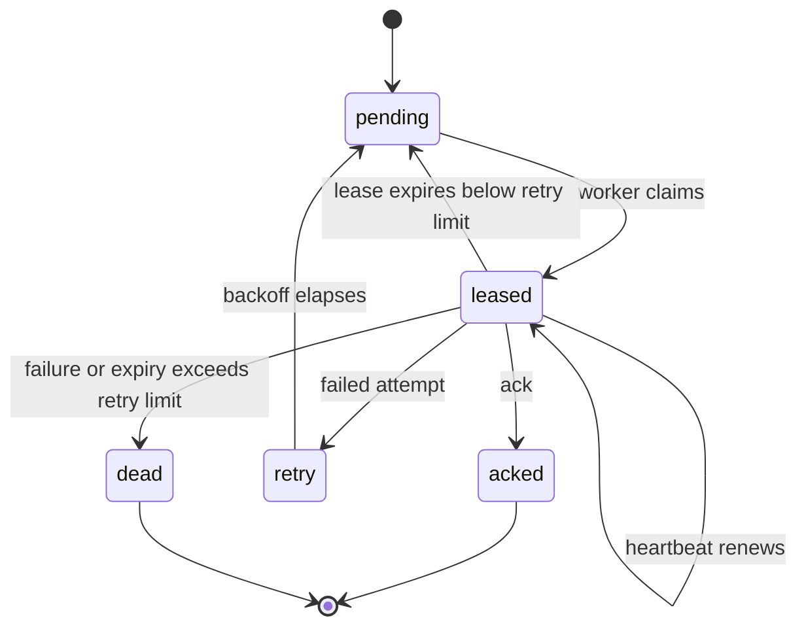

# Cogs

Cogs is a small self hosted background job service: one Go server and Redis. It exposes an HTTP API for enqueueing, claiming, retrying, scheduling, and acknowledging jobs. Workers can be written in any language; Go, Python, and Node client code is included.

Cogs is designed for at least once delivery, with the lease and stale-worker limitations described below. A claim creates a time limited lease. Workers renew while processing and acknowledge on success. If a worker disappears, the reaper moves the expired lease back to the queue. Handlers must therefore be idempotent: a worker can finish its side effect and die before its acknowledgement reaches Cogs.

## Status

The implemented service includes the Go API, Redis Lua state transitions, retries with jittered backoff, dead lettering, cron schedules, leader election for background loops, Prometheus metrics, and SDK examples. The repository does not currently contain a production dashboard, AWS deployment, or published throughput result. `demo/index.html` is a self contained lease simulation for explaining the protocol; it is not a live dashboard.

## Run it locally

Requirements: the Go version declared in `go.mod` (currently 1.26.3), Docker, and Docker Compose.

```powershell
docker compose up -d redis
$env:DEFAULT_LEASE_SECONDS = '60' # Gives time to copy the manual requests below
go run ./cmd/cogs
```

Enqueue a job:

```sh
curl -X POST http://localhost:8080/v1/jobs \
  -H 'Content-Type: application/json' \
  -d '{"queue":"emails","payload":{"to":"a@example.com"}}'
```

Claim it (the response includes the lease and heartbeat intervals):

```sh
curl -X POST http://localhost:8080/v1/jobs/claim \
  -H 'Content-Type: application/json' \
  -d '{"queues":["emails"],"batch":1,"wait_ms":1000,"worker_id":"demo"}'
```

Use the returned job ID and queue to renew, then acknowledge:

```sh
curl -X POST http://localhost:8080/v1/jobs/JOB_ID/renew \
  -H 'Content-Type: application/json' -d '{"queue":"emails"}'
curl -X POST http://localhost:8080/v1/jobs/JOB_ID/ack \
  -H 'Content-Type: application/json' -d '{"queue":"emails"}'
```

Set `AUTH_TOKEN` before starting the server to require `Authorization: Bearer ...`. Without it, authentication is disabled for local development. See [PROTOCOL.md](PROTOCOL.md) for the worker loop and [docs/API.md](docs/API.md) for endpoint details.

## How it works

Redis is the source of truth. Pending jobs are IDs in a FIFO list, active leases and retry times are sorted sets, and job payloads are hashes. Claim, renew, ack, fail, and reaping transitions use atomic Lua scripts. A Redis lease lock makes one server run the reaper, retry drainer, and scheduler while every server can serve HTTP.





The lease design prevents loss when a worker or server process crashes, provided Redis retains the write. The default Compose Redis uses AOF with `appendfsync everysec`; a Redis failure or failover can still lose recent writes depending on its durability and replication configuration. There are no fencing or generation tokens today, so a stale worker that continues after a lost lease can still submit mutations by job ID; SDKs treat renew HTTP 409 as a signal to abandon work, but side effects in the handler cannot be cancelled by Cogs.

## Reliability and benchmarks

The tests use real Redis. Start a dedicated disposable test dependency and run them serially:

```powershell
docker run --name cogs-test-redis --rm -d -p 127.0.0.1:16379:6379 redis:7-alpine
$env:REDIS_ADDR = '127.0.0.1:16379'
$env:COGS_TEST_REDIS = '1'
go test -p 1 ./...
docker stop cogs-test-redis
```

Tests flush the selected Redis database, so use a disposable Redis instance or database. The chaos test starts and kills real worker processes and checks for missing jobs; it is a useful correctness exercise, not a published statistical guarantee. The load generator is available at `loadtest/`; record any throughput or latency claim only with the command, Redis/server versions, configuration, and hardware captured alongside the result.

For a local benchmark, start Cogs against a separate running Redis instance and run the following from another terminal. Capture hardware and configuration alongside the output before publishing results:

```powershell
go run ./loadtest -sweep -dur 60s -producers 32 -consumers 32
```

## Demo

Open `demo/index.html` in a browser or serve the repository directory with a static file server. It simulates pending, leased, expired, requeued, and acknowledged jobs and can be embedded in a static page with an iframe:

```html
<iframe src="demo/index.html" title="Cogs lease simulation" width="100%" height="900"></iframe>
```

It does not connect to Cogs or claim production behavior.

## Limitations and roadmap

Cogs is intended for small to medium workloads on one Redis instance. It does not provide exactly once execution, pub/sub fan out, SQL querying, multi tenancy, broker clustering, or a production UI. Queue names are intentionally simple and Lua key construction is not Redis Cluster safe.

The next reliability work is fencing/generation tokens so stale workers cannot mutate a reclaimed lease, followed by reproducible benchmark runs on named hardware. A real dashboard and deployment examples can be added after those claims are backed by maintained artifacts.

Licensed under the [MIT License](LICENSE).
